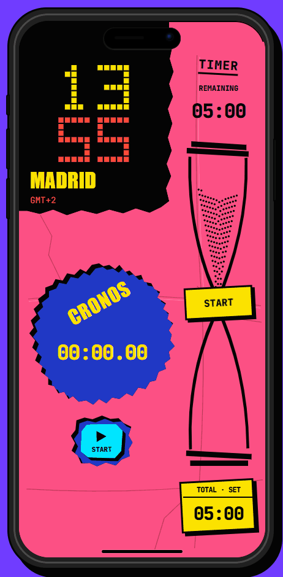
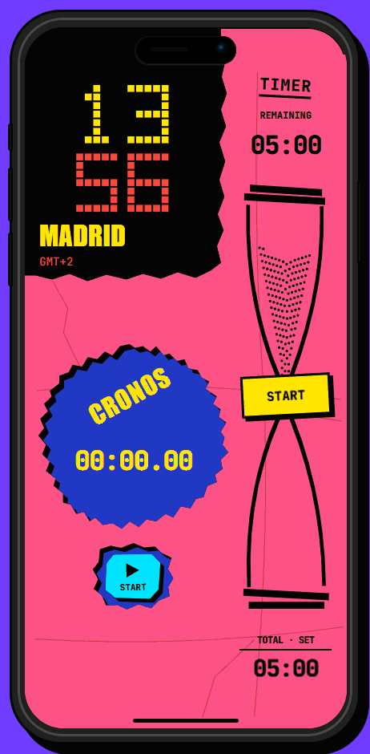

# CRONO

Prototipo móvil de reloj mundial, temporizador y cronómetro construido con React, TypeScript y Vite. La interfaz aplica una dirección neobrutalista mediante colores planos y saturados, contornos gruesos, sombras duras, tipografía monoespaciada y una composición de papel recortado.

En escritorio y tablet se presenta dentro de un lienzo de iPhone con zoom. En teléfonos reales, la interfaz ocupa directamente toda la pantalla, respeta las zonas seguras del dispositivo y conserva su composición vertical al girar el teléfono.

**[Abrir la demostración interactiva](https://r3neer.github.io/crono-neobrutal/)**

## Demostraciones

### Tiempo, físicas y respuesta



### Relojes mundiales y paletas



## Ejecutar localmente

```powershell
npm install
npm run dev -- --port 5173
```

Abre `http://127.0.0.1:5173/`. Para comprobar la versión de producción:

```powershell
npm run build
npm run preview
```

## Regenerar los GIF

Con el servidor local abierto en el puerto `5173`:

```powershell
npm run capture:demos
```

El script captura los recorridos en Microsoft Edge y escribe los GIF finales en `public/demos/`. Los fotogramas intermedios se guardan bajo `artifacts/demo-frames/` y están excluidos del repositorio.

## Estructura

- `src/main.tsx`: relojes digitales, temporizador, físicas de arena, cronómetro y gestión de ciudades.
- `src/style.css`: lienzo de iPhone, collage, recortes, sombras, paletas y animaciones.
- `public/demos/`: demostraciones animadas listas para el README.
- `scripts/capture-demos.cjs`: recorridos reproducibles con Playwright.
- `scripts/build-gifs.py`: paleta compartida y empaquetado de fotogramas.
- `DESIGN.md`: brief original y decisiones de diseño posteriores.

## Alcance

Las ciudades y el reloj principal se guardan en `localStorage`. Los temporizadores activos sobreviven a la navegación interna, pero no a una recarga del navegador. Los relojes mundiales utilizan zonas IANA reales. No existe backend, alarma en segundo plano ni sonido.

JetBrains Mono se incluye localmente con su licencia OFL. Impact usa la fuente del sistema con una alternativa condensada.
